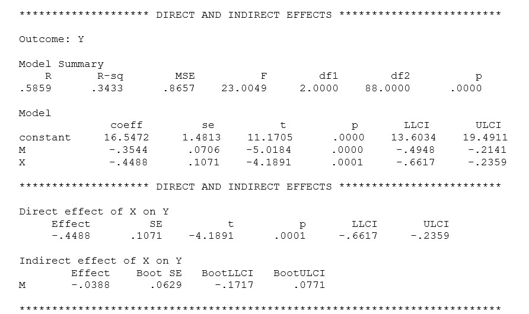

```{r, echo = FALSE, results = "hide"}
include_supplement("uu-mediation-804-en-tabel.jpg", recursive = TRUE)
```

```{r, echo = FALSE, results = "hide"}
include_supplement("uu-mediation-804-en-tabel2.jpg", recursive = TRUE)
```

```{r, echo = FALSE, results = "hide"}
include_supplement("uu-mediation-804-en-tabel3.jpg", recursive = TRUE)
```

```{r, echo = FALSE, results = "hide"}
include_supplement("uu-mediation-804-en-tabel4.jpg", recursive = TRUE)
```

```{r, echo = FALSE, results = "hide"}
include_supplement("uu-mediation-804-en-tabel5.jpg", recursive = TRUE)
```

Question
========
  
Which figure is a graphic representation of the relationship between the variables X, M and Y based on the results in the table?




A:


B:


C:


D:


  
Answerlist
----------
* A
* B
* C
* D

Solution
========
The output shown above belongs to a mediation analysis. The graphic representation in answer A shows a moderation effect, so this answer is wrong. 

In the output you can see that the indirect effect is not significant (the value 0 lies within the 95% confidence interval, this means there is no significant effect). The effect of X on Y, given M, is significant (p=.0001). The effect of M on Y, given X, is significant (p<.0001). This corresponds with picture D.
  


Meta-information
================
exname: uu-mediation-804-en.Rmd
extype: schoice
exsolution: 0001
exsection: Inferential Statistics/Regression/Multiple linear regression/Mediation
exextra[ID]: e3c1b
exextra[Type]: Interpretating output
exextra[Program]: SPSS
exextra[Language]: English
exextra[Level]: Statistical Literacy
