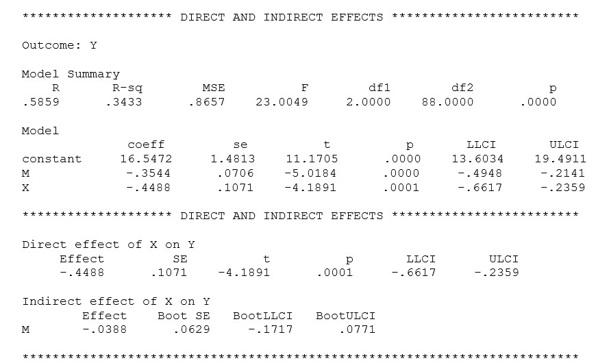
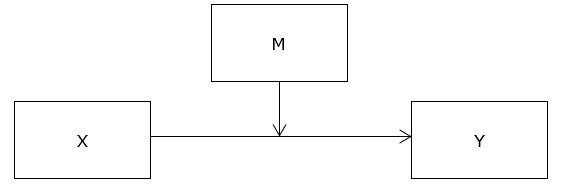
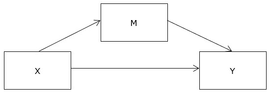
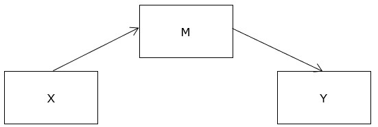
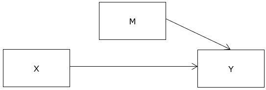

```{r, echo = FALSE, results = "hide"}
include_supplement("uu-mediation-804-en-tabel.jpg", recursive = TRUE)
```

```{r, echo = FALSE, results = "hide"}
include_supplement("uu-mediation-804-en-tabel2.jpg", recursive = TRUE)
```

```{r, echo = FALSE, results = "hide"}
include_supplement("uu-mediation-804-en-tabel3.jpg", recursive = TRUE)
```

```{r, echo = FALSE, results = "hide"}
include_supplement("uu-mediation-804-en-tabel4.jpg", recursive = TRUE)
```

```{r, echo = FALSE, results = "hide"}
include_supplement("uu-mediation-804-en-tabel5.jpg", recursive = TRUE)
```

Question
========
  
Welke figuur is een grafische weergave van de relatie tussen de variabelen X, M en Y op basis van de resultaten in de tabel?



A:



B:



C:



D:


  
Antwoordlijst
----------
* A
* B
* C
* D

Solution
========
De uitvoer hierboven hoort bij een bemiddelingsanalyse. De grafische weergave in antwoord A toont een moderatie-effect, dus dit antwoord is fout.

In de uitvoer kun je zien dat het indirecte effect niet significant is (de waarde 0 ligt binnen het 95% betrouwbaarheidsinterval, dit betekent dat er geen significant effect is). Het effect van X op Y, gegeven M, is significant (p=.0001). Het effect van M op Y, gegeven X, is significant (p<.0001). Dit komt overeen met afbeelding D.

Meta-information
================
exname: uu-mediation-804-nl
extype: schoice
exsolution: 0001
exsection: Inferential Statistics/Regression/Multiple linear regression/Mediation
exextra[Type]: Interpretating output
exextra[Program]: SPSS
exextra[Language]: Dutch
exextra[Level]: Statistical Literacy
