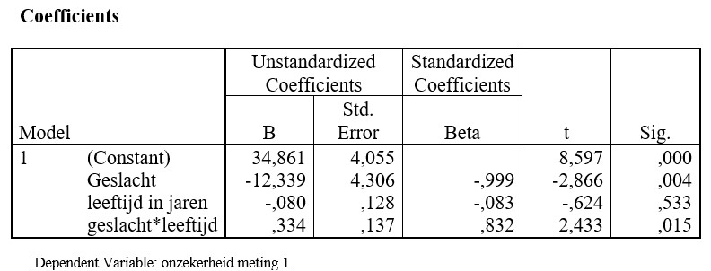

```{r, echo = FALSE, results = "hide"}
include_supplement("uu-moderation-800-nl-tabel.jpg", recursive = TRUE)
```

Question
========
  
A researcher wonders if gender is a moderator in his research. Check out the output below. 



What does this output show? 
Answerlist
----------
* Gender is a moderator, because gender is significant.
* Gender is not a moderator, because gender is not significant.
* Gender is a moderator, because the interaction between age and gender is significant.
* Gender is not a moderator, because the interaction between age and gender is not significant.


Solution
========

Meta-information
================
exname: uu-moderation-800-en
extype: schoice
exsolution: 0010
exsection: Inferential Statistics/Regression/Multiple linear regression/Moderation
exextra[ID]: d8ab0
exextra[Type]: Interpretating output
exextra[Program]: SPSS
exextra[Language]: English
exextra[Level]: Statistical Literacy
