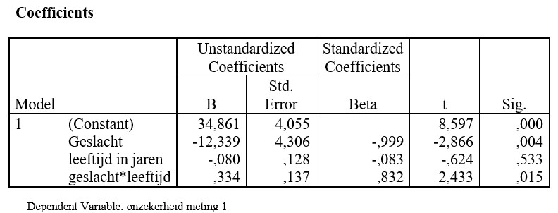

```{r, echo = FALSE, results = "hide"}
include_supplement("uu-moderation-800-nl-tabel.jpg", recursive = TRUE)
```


Question
========
  
Een onderzoeker vraagt zich af of geslacht een moderator is in zijn onderzoek. Bekijk de output hieronder. 



Wat blijkt uit deze output?
  
Answerlist
----------
* Geslacht is een moderator, want geslacht is significant.
* Geslacht is geen moderator, want geslacht is niet significant.
* Geslacht is een moderator, want de interactie tussen leeftijd en geslacht is significant. 
* Geslacht is geen moderator, want de interactie tussen leeftijd en geslacht is niet significant.


Solution
========
  


Meta-information
================
exname: uu-moderation-800-nl.Rmd
extype: schoice
exsolution: 0010
exsection: Inferential Statistics/Regression/Multiple linear regression/Moderation
exextra[Type]: Interpretating output
exextra[Program]: SPSS
exextra[Language]: Dutch
exextra[Level]: Statistical Literacy
