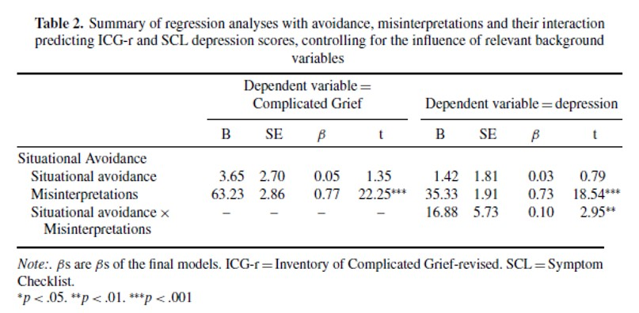

```{r, echo = FALSE, results = "hide"}
include_supplement("uu-moderation-801-nl-tabel.jpg", recursive = TRUE)
```

Question
========
  
The table below is from the article by Boelen and van den Hout (2007), The role of threatening misinterpretations and avoidance in emotional problems after loss. 



One researcher questions whether Situational Avoidance is a moderator of the effect of Misinterpretations on Depression. The table shows that: 
Answerlist
----------
* Situational Avoidance is a moderator, because the effect of Situational Avoidance is significant
* Situational Avoidance is not a moderator, because the effect of Situational Avoidance is not significant
* Situational Avoidance is a moderator, because the interaction between Misinterpretations and Situational Avoidance is significant
* Situational Avoidance is not a moderator, because the interaction between Misinterpretations and Situational Avoidance is not significant


Solution
========
  
The table shows that the main effect of Situational Avoidance is not significant, and that the main effect of Misinterpretations as well as the interaction effect between Misinterpretations and Situational Avoidance is significant. To determine whether Situational Avoidance is a moderator (i.e., does X interact with Situational Avoidance), look at the interaction between Misinterpretations and Situational Avoidance. This is significant, which means that Situational Avoidance is a moderator.

Meta-information
================
exname: uu-moderation-801-en
extype: schoice
exsolution: 0010
exsection: Inferential Statistics/Regression/Multiple linear regression/Moderation
exextra[ID]: adfc4
exextra[Type]: Interpretating output
exextra[Program]: SPSS
exextra[Language]: English
exextra[Level]: Statistical Literacy
