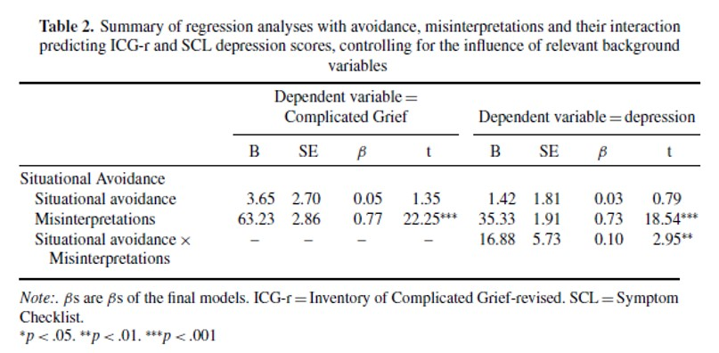

```{r, echo = FALSE, results = "hide"}
include_supplement("uu-moderation-801-nl-tabel.jpg", recursive = TRUE)
```


Question
========
  
Onderstaande tabel komt uit het artikel  van Boelen en van den Hout (2007), The role of threatening misinterpretations and avoidance in emotional problems after loss. 



Een onderzoeker vraagt zich af of Situational Avoidance een moderator is voor het effect van Misinterpretations op Depression. Uit de tabel blijkt dat: 
  
Answerlist
----------
* Situational Avoidance een moderator is, want het effect van Situational Avoidance is significant
* Situational Avoidance geen moderator is, want het effect van Situational Avoidance is niet significant
* Situational Avoidance een moderator is, want de interactie tussen Misinterpretations en Situational Avoidance is significant 
* Situational Avoidance geen moderator is, want de interactie tussen Misinterpretations en Situational Avoidance is niet significant


Solution
========
  
In de tabel is te zien dat  het hoofdeffect van Situational Avoidance niet significant is, en dat het hoofdeffect van Misinterpretattions én het interactie-effect tussen Misinterpretations en Situational Avoidance wel significant is. Om te bepalen of Situational Avoidance een moderator is (oftewel is er sprake van interactie tussen X en Situational Avoidance), moet je kijken naar de interactie tussen Misinterpretations en Situational Avoidance. Deze is significant, wat betekent dat Situational Avoidance een moderator is. 

Meta-information
================
exname: uu-moderation-801-nl.Rmd
extype: schoice
exsolution: 0010
exsection: Inferential Statistics/Regression/Multiple linear regression/Moderation
exextra[ID]: d49b6
exextra[Type]: Interpretating output
exextra[Program]: SPSS
exextra[Language]: Dutch
exextra[Level]: Statistical Literacy
