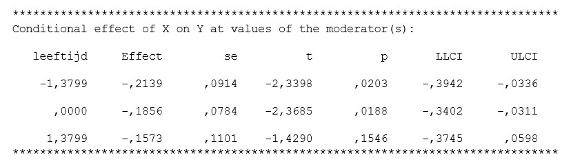

```{r, echo = FALSE, results = "hide"}
include_supplement("uu-moderation-802-nl-tabel.jpg", recursive = TRUE)
```

Question
========
  
The output below belongs to a study that examined whether age is a moderator of the relationship between an independent and dependent variable.



A psychologist draws the following conclusions based on the output. I. The higher a person scores on the moderator, the weaker the relationship between the independent and dependent variable. II.  For someone who scores above average on the moderator, there is a significant relationship between the independent and dependent variable. Which conclusions is/are correct based on the output?

  
Answerlist
----------
* Only conclusion I is correct.
* Only conclusion II is correct.
* Both conclusion I and conclusion II are correct.
* Neither conclusion is correct.


Solution
========
Conclusion I is correct. With a higher score on the moderator, the relationship between the independent and dependent variable becomes weaker; namely, from -.2139 to -.1573.

Conclusion II is not correct. On the contrary, for someone who scores above average (see bottom row in table), there is no significant relationship between the independent and dependent variable (p = .1546).

Meta-information
================
exname: uu-moderation-802-en
extype: schoice
exsolution: 1000
exsection: Inferential Statistics/Regression/Multiple linear regression/Moderation
exextra[Type]: Interpretating output
exextra[Program]: SPSS
exextra[Language]: English
exextra[Level]: Statistical Literacy
