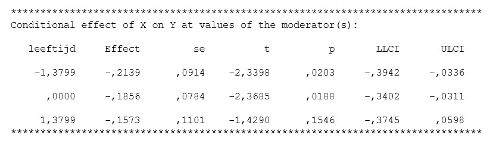

```{r, echo = FALSE, results = "hide"}
include_supplement("uu-moderation-802-nl-tabel.jpg", recursive = TRUE)
```


Question
========
  
Onderstaande output hoort bij een onderzoek waarin is gekeken of leeftijd een moderator is voor de relatie tussen een onafhankelijke en afhankelijke variabele.



Een psycholoog trekt op basis van de output de volgende conclusies.
I. Hoe hoger een persoon scoort op de moderator, des te zwakker het verband tussen de onafhankelijke en afhankelijke variabele.
II.  Voor iemand die bovengemiddeld scoort op de moderator, is er een significant verband tussen de onafhankelijke en de afhankelijke variabele. 
Welke conclusies is/zijn correct op basis van de output? 

  
Answerlist
----------
* Alleen conclusie I is correct. 
* Alleen conclusie II is correct. 
* Zowel conclusie I als conclusie II is correct.
* Geen van beide conclusies is correct.


Solution
========
Conclusie I is correct. 
Bij een hogere score op de moderator, wordt het verband tussen de onafhankelijke en afhankelijke variabele zwakker; namelijk van -.2139 naar -.1573. 

Conclusie II is niet correct. 
Voor iemand die bovengemiddeld scoort (zie onderste rij in tabel), is er juist géén significant verband tussen de onafhankelijke en afhankelijke variabele (p = .1546). 


Answerlist
----------


Meta-information
================
exname: uu-moderation-802-nl.Rmd
extype: schoice
exsolution: 1000
exsection: Inferential Statistics/Regression/Multiple linear regression/Moderation
exextra[Type]: Interpretating output
exextra[Program]: SPSS
exextra[Language]: Dutch
exextra[Level]: Statistical Literacy
