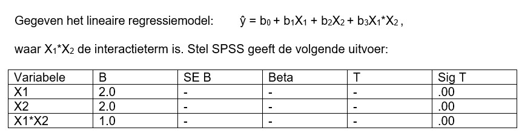

```{r, echo = FALSE, results = "hide"}
include_supplement("uu-moderation-803-nl-tabel.jpg", recursive = TRUE)
```

Question
========
  



Which statement is correct given this information? 
Answerlist
----------
* X1 is a mediator in this analysis
* X2 is a mediator in this analysis.
* X2 is a moderator in this analysis.   
* Y is a moderator in this analysis.


Solution
========

Meta-information
================
exname: uu-moderation-803-en
extype: schoice
exsolution: 0010
exsection: Inferential Statistics/Regression/Multiple linear regression/Moderation
exextra[Type]: Interpretating output
exextra[Program]: SPSS
exextra[Language]: English
exextra[Level]: Statistical Literacy
