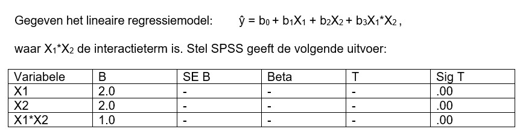

```{r, echo = FALSE, results = "hide"}
include_supplement("uu-moderation-803-nl-tabel.jpg", recursive = TRUE)
```


Question
========
  



Welke bewering is juist gegeven deze informatie?
  
Answerlist
----------
* X1 is een mediator in deze analyse
* X2 is een mediator in deze analyse.
* X2 is een moderator in deze analyse.   
* Y is een moderator in deze analyse.


Solution
========
  


Answerlist
----------


Meta-information
================
exname: uu-moderation-803-nl.Rmd
extype: schoice
exsolution: 0010
exsection: Inferential Statistics/Regression/Multiple linear regression/Moderation
exextra[Type]: Interpretating output
exextra[Program]: SPSS
exextra[Language]: Dutch
exextra[Level]: Statistical Literacy
