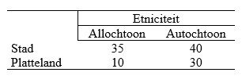

```{r, echo = FALSE, results = "hide"}
include_supplement("uu-moderation-804-nl-tabel.jpg", recursive = TRUE)
```

Question
========
  
A study of behavior in traffic is being conducted at Maastricht University. The researchers want to know if there are differences between people living in rural areas and those living in cities. The researchers also want to know if ethnicity has an influence on this. The table below shows the results of the study. (Note: the numbers represent group averages of the behavioral scores assigned to the participants in this study).



What type of effect is visible in the table above? 
Answerlist
----------
* A main effect of ethnicity and an interaction effect.
* A main effect of residence and an interaction effect.
* A main effect of both ethnicity and residence, and also an interaction effect.
* A main effect of both ethnicity and place of residence, but no interaction effect.


Solution
========

Meta-information
================
exname: uu-moderation-804-en
extype: schoice
exsolution: 0010
exsection: Inferential Statistics/Regression/Multiple linear regression/Moderation
exextra[ID]: bf746
exextra[Type]: Interpretating output
exextra[Language]: English
exextra[Level]: Statistical Literacy
