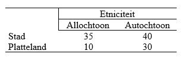

```{r, echo = FALSE, results = "hide"}
include_supplement("uu-moderation-804-nl-tabel.jpg", recursive = TRUE)
```


Question
========
  
Aan de universiteit van Maastricht wordt een onderzoek gedaan naar gedrag in het verkeer. De onderzoekers willen weten of er verschillen zijn tussen mensen die op het platteland wonen en mensen die in de stad wonen. Ook willen de onderzoekers weten of etniciteit hier invloed op heeft. De onderstaande tabel geeft het resultaat van het onderzoek weer. (N.B. de getallen staan voor groepsgemiddelden van de gedrags¬scores die zijn toegekend aan de deelnemers van dit onderzoek).



Welk soort effect is in bovenstaande tabel zichtbaar? 
  
Answerlist
----------
* Een hoofdeffect van etniciteit en een interactie-effect.
* Een hoofdeffect van woonplaats en een interactie-effect.
* Een hoofdeffect van zowel etniciteit als woonplaats, en ook een interactie-effect.
* Een hoofdeffect van zowel etniciteit als woonplaats, maar geen interactie-effect.


Solution
========
  


Meta-information
================
exname: uu-moderation-804-nl.Rmd
extype: schoice
exsolution: 0010
exsection: Inferential Statistics/Regression/Multiple linear regression/Moderation
exextra[Type]: Interpretating output
exextra[Language]: Dutch
exextra[Level]: Statistical Literacy
