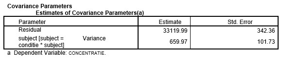

```{r, echo = FALSE, results = "hide"}
include_supplement("uu-multilevel-analysis-801-nl-tabel.jpg", recursive = TRUE)
```
Question
========
A study on concentration ability (CONCENTRATION) of children with ADHD distinguishes two levels of influences. At level 1 the influence of some child characteristics and at level 2 the influence of class characteristics on concentration ability. The table shows part of the SPSS output of a multilevel analysis.

This table shows the following about the variance of CONCENTRATION:



  
Answerlist
----------
* About 2% of the total variance is second-level variance.
* About 98% of total variance is second-level variance.
* About 2% of total variance is explained variance by first-level characteristics.
* About 98% of the total variance is explained variance by first-level characteristics.

Solution
========

Meta-information
================
exname: uu-multilevel-analysis-801-en
extype: schoice
exsolution: 1000
exsection: Inferential Statistics/Multilevel Analysis
exextra[ID]: c5113
exextra[Type]: Interpretating output
exextra[Program]: SPSS
exextra[Language]: English
exextra[Level]: Statistical Literacy
