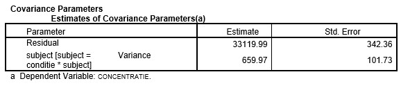

```{r, echo = FALSE, results = "hide"}
include_supplement("uu-multilevel-analysis-801-nl-tabel.jpg", recursive = TRUE)
```
Question
========
In een onderzoek naar concentratievermogen (CONCENTRATIE) van kinderen met ADHD worden twee niveaus van invloeden onderscheiden. Op niveau 1 de invloed van een aantal kindkenmerken en op niveau 2 de invloed van klaskenmerken op concentratievermogen. In de tabel is een deel van de SPSS uitvoer van een multilevel analyse weergegeven.

Uit deze tabel blijkt het volgende over de variantie van CONCENTRATIE:



  
Answerlist
----------
* ongeveer 2% van de totale variantie is variantie op het tweede niveau.
* ongeveer 98% van de totale variantie is variantie op het tweede niveau.
* ongeveer 2% van de totale variantie is verklaarde variantie door kenmerken op het eerste niveau.
* ongeveer 98% van de totale variantie is verklaarde variantie door kenmerken op het eerste niveau.

Solution
========
  
Meta-information
================
exname: uu-multilevel-analysis-801-nl
extype: schoice
exsolution: 1000
exsection: Inferential Statistics/Multilevel Analysis
exextra[Type]: Interpretating output
exextra[Program]: SPSS
exextra[Language]: Dutch
exextra[Level]: Statistical Literacy
