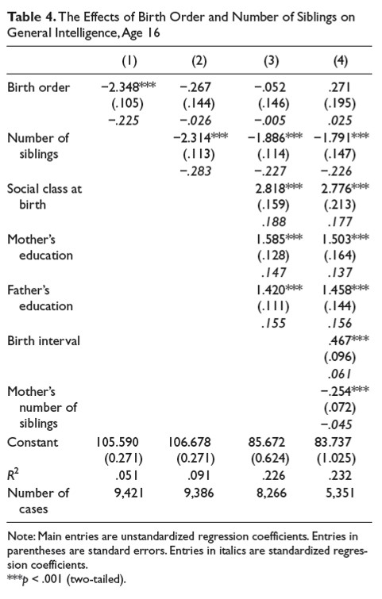

```{r, echo = FALSE, results = "hide"}
include_supplement("uu-multiple-linear-regression-818-nl-tabel.jpg", recursive = TRUE)
```

Question
========
The table below is from Kanazawa's (2012) article. 



Which conclusion is correct based on the table?

Answerlist
----------
* Model 2 explains 9.1% more variance than model 1.
* The predicted intelligence of an only child is higher based on model 1 than on model 2.
* In model 4, social class at birth is a stronger predictor of intelligence than number of siblings.
* The number of siblings of 35 participants is unknown.


Solution
========
In model 1 there is only one predictor: birth order. In model 2 there is a second predictor: number of siblings. The bottom line of the table shows that in model 1 the analysis was done with 9421 respondents, and in model 2 with 35 fewer respondents, 9386 respondents. This means that 35 respondents apparently do not know how many siblings they have. They were not included in the analysis in model 2.

Incorrect: Model 2 explains 9.1% more variance than Model 1. A total of 9.1% variance is explained in model 2, which is exactly 4% more than in model 1, where 5.1% variance is explained.

The predicted intelligence of an only child is higher based on model 1 than on model 2. We can calculate the predicted intelligence for both models:
-For model 1 this is: Predicted intelligence = B_{0} + B_{1} x Birth order = 105,590 -2,348 x 1 = 103,242
-For model 2 this is: Predicted intelligence = B_{0} + B_{1} x Birth order + B_{2} x siblings = 106.678 - 0.267 - 2.314 x 0 = 106.411

In model 4, social class at birth is a stronger predictor of intelligence than number of siblings. For this we need to look at (the absolute values of) the Betas: the standardized regression coefficients. These are the numbers in italics in the table (see footnote). Looking at the Betas in model 4, we see that social class at birth actually has a smaller Beta (.177) than number of siblings (-.226).

Meta-information
================
exname: uu-multiple-linear-regression-818-en
extype: schoice
exsolution: 0001
exsection: Inferential Statistics/Regression/Multiple linear regression
exextra[Type]: Interpretating output
exextra[Program]: 
exextra[Language]: English
exextra[Level]: Statistical Literacy