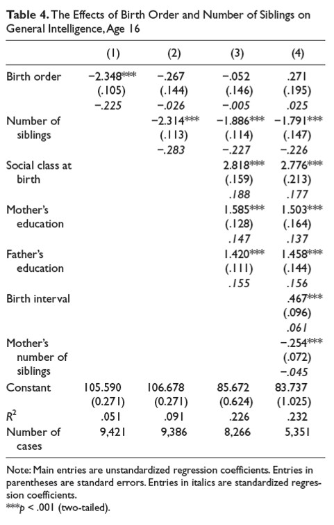

```{r, echo = FALSE, results = "hide"}
include_supplement("uu-multiple-linear-regression-818-nl-tabel.jpg", recursive = TRUE)
```


Question
========
Onderstaande tabel komt uit het artikel van Kanazawa (2012). 



Welke conclusie is juist op basis van de tabel?

Answerlist
----------
* In model 2 wordt 9.1% meer variantie verklaard dan in model 1.
* De voorspelde intelligentie van een enig kind is hoger op basis van model 1 dan op basis van model 2.
* In model 4 is social class at birth een sterkere voorspeller van intelligentie dan number of siblings.
* Van 35 participanten is onbekend hoeveel broers/zussen zij hebben (number of siblings).


Solution
========
In model 1 zit slechts één predictor: geboortevolgorde. In model 2 komt er een tweede predictor bij: aantal broers/zussen. In de onderste regel van de tabel is te zien dat in model 1 de analyse is gedaan met 9421 respondenten, en in model 2 met 35 respondenten minder, namelijk met 9386 respondenten. Dit betekent dat van 35 respondenten blijkbaar niet bekend is hoeveel broers/zussen zij hebben. Zij zijn in model 2 niet meegenomen in de analyse.

Onjuist:
In model 2 wordt 9.1% meer variantie verklaard dan in model 1.
In model 2 wordt in totaal 9.1% variantie verklaard, dit is precies 4% meer dan in model 1, waar 5.1% variantie wordt verklaard. 

De voorspelde intelligentie van een enig kind is hoger op basis van model 1 dan op basis van model 2.
We kunnen de voorspelde intelligentie voor beide modellen uitrekenen:
-Voor model 1 is dit: Voorspelde intelligentie = B_{0} + B_{1} x Birth order = 105.590 -2.348 x 1 = 103.242
-Voor model 2 is dit: Voorspelde intelligentie = B_{0} + B_{1} x Birth order + B_{2} x siblings = 106.678 - 0.267 – 2.314 x 0 = 106.411

In model 4 is social class at birth een sterkere voorspeller van intelligentie dan number of siblings.
Hiervoor moeten we kijken naar (de absolute waardes van) de Beta’s: de gestandaardiseerde regressiecoëfficiënten. Dit zijn de schuingedrukte getallen in de tabel (zie voetnoot). Als we de beta’s in model 4 bekijken, dan zien we dat social class at birth juist een kleinere Beta heeft (.177) dan number of siblings (-.226).


Meta-information
================
exname: uu-multiple-linear-regression-818-nl.Rmd
extype: schoice
exsolution: 0001
exsection: Inferential Statistics/Regression/Multiple linear regression
exextra[Type]: Interpretating output
exextra[Program]: 
exextra[Language]: Dutch
exextra[Level]: Statistical Literacy