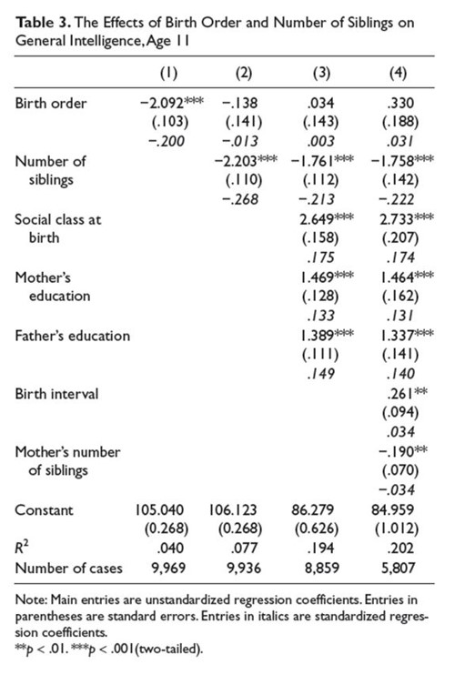

```{r, echo = FALSE, results = "hide"}
include_supplement("uu-multiple-linear-regression-819-nl-tabel.jpg", recursive = TRUE)
```
Question
========
Onderstaande tabel komt uit het artikel van Kanazawa (2012). In de tabel vind je resultaten van de analyses die zijn uitgevoerd om "General Intelligence, age 11" te voorspellen. 



Twee studenten doen beide een uitspraak over de tabel:

I Van 33 participanten is onbekend hoeveel broers/zussen zij hebben
II In model 4 is "Father's education" een sterkere voorspeller van "Intelligentie" dan "Mother's education".

Welke student heeft gelijk?

Answerlist
----------
* Alleen student 1 heeft gelijk
* Alleen student 2 heeft gelijk
* Zowel stedent 1 als student 2 heeft gelijk
* Geen van beide studenten heeft gelijk


Solution
========


Meta-information
================
exname: uu-multiple-linear-regression-819-nl.Rmd
extype: schoice
exsolution: 0010
exsection: Inferential Statistics/Regression/Multiple linear regression
exextra[Type]: Interpretating output
exextra[Program]: 
exextra[Language]: Dutch
exextra[Level]: Statistical Literacy