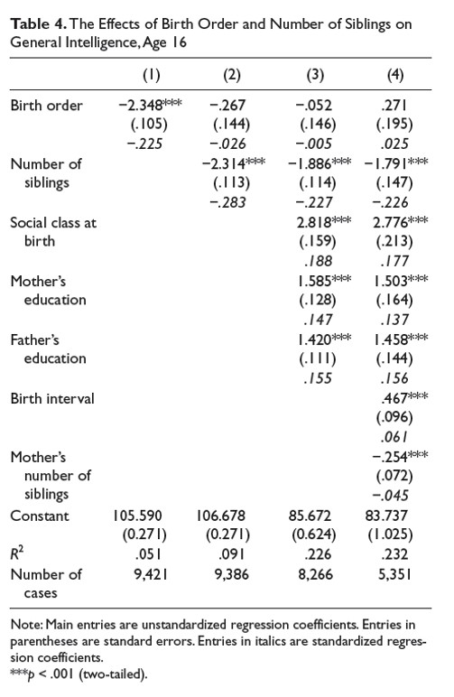

```{r, echo = FALSE, results = "hide"}
include_supplement("uu-multiple-linear-regression-820-en-tabel.jpg", recursive = TRUE)
```
Question
========
The table below is taken from Kanazawa's article Intelligence, Birth Order, and Family Size (2012).


  
Which conclusion is correct based on the table?

Answerlist
----------
* In model 2,9.1% more variance is explained than in model 1.
* The predicted Intelligence of a single child is higher based on model 1 than on model 2.
* In model 4, Social class at birth is a stronger predictor of Intelligence than Number of siblings.
* Of 35 participants it is unknown what their number of siblings is.


Solution
========
In model 2, a second predictor: Number of siblings is added to the model. At the bottom of the table you can see that the number of participants drops with 35 from model 1 (9,421 respondents) to model 2 (9,386 respondents). So when the predictor Number of siblings is added to the model, there are 35 participants less in the analysis. This means that of those 35 participants it is unknown what their number of siblings is. 

Why are the other answers incorrect?

-In model 2,9.1% more variance is explained than in model 1. 
In model 2 9.1% (R squared = .091) variance is explained. In model 1 5.1% (R^2 = .051) variance is explained. The difference in explained variance between the two models is: 9.1% - 5.1% = 4%. 

-The predicted Intelligence of a single child is higher based on model 1 than on model 2. 
The predicted Intelligence of a single child in model 1 is: 105.590 - 2.348*1 = 103.242.
The predicted Intelligence of a single child in model 2 is: 106.678 - 0.267*1 - 2.314* 0 = 106.411.

-In model 4, Social class at birth is a stronger predictor of Intelligence than Number of siblings. This is incorrect.
To decide which predictor is the stronger one, we have to look at the standardized regression coefficients. Those are the numbers expressed in italics. The standardized regression coefficient of Social class at birth equals 0.177, and the standardized regression coefficient of Number of siblings equals -0.226. Number of siblings has the bigger absolute value of the standardized regression coefficient, and so is the stronger predictor out of the two.


Meta-information
================
exname: uu-multiple-linear-regression-820-en.Rmd
extype: schoice
exsolution: 0001
exsection: Inferential Statistics/Regression/Multiple linear regression
exextra[ID]: 8209e
exextra[Type]: Interpretating output
exextra[Program]: 
exextra[Language]: English
exextra[Level]: Statistical Literacy