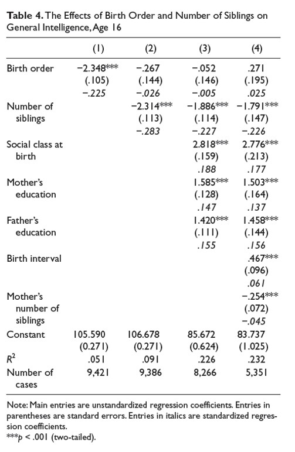

```{r, echo = FALSE, results = "hide"}
include_supplement("uu-multiple-linear-regression-820-en-tabel.jpg", recursive = TRUE)
```
Question
========
De tabel hieronder komt uit Kanazawa's artikel Intelligence, Birth Order, and Family Size (2012).


  
Welke conclusie is juist op basis van de tabel?

Answerlist
----------
* In model 2 wordt 9,1% meer variantie verklaard dan in model 1.
* De voorspelde Intelligentie van één kind is hoger op basis van model 1 dan op basis van model 2.
* In model 4 is Sociale klasse bij geboorte een sterkere voorspeller van Intelligentie dan Aantal broers en zussen.
* Van 35 deelnemers is het aantal broers en zussen onbekend.


Solution
========
In model 2 wordt een tweede voorspeller: Aantal broers en zussen toegevoegd aan het model. Onderaan de tabel kun je zien dat het aantal deelnemers met 35 daalt van model 1 (9.421 respondenten) naar model 2 (9.386 respondenten). Dus als de voorspeller Aantal broers en zussen aan het model wordt toegevoegd, zijn er 35 deelnemers minder in de analyse. Dit betekent dat van deze 35 deelnemers niet bekend is hoeveel broers of zussen ze hebben.

Waarom zijn de andere antwoorden onjuist?

-In model 2 wordt 9,1% meer variantie verklaard dan in model 1. In model 2 wordt 9,1% (R kwadraat = .091) variantie verklaard. In model 1 wordt 5,1% (R^2 = .051) variantie verklaard. Het verschil in verklaarde variantie tussen de twee modellen is: 9.1% - 5.1% = 4%.

-De voorspelde Intelligentie van een alleenstaand kind is hoger op basis van model 1 dan op basis van model 2. De voorspelde Intelligentie van een alleenstaand kind in model 1 is: 105.590 - 2.348*1 = 103.242. De voorspelde Intelligentie van een alleenstaand kind in model 2 is: 106.678 - 0.267*1 - 2.314* 0 = 106.411.

-In model 4 is Sociale klasse bij geboorte een sterkere voorspeller van Intelligentie dan Aantal broers en zussen. Dit is onjuist. Om te bepalen welke voorspeller de sterkste is, moeten we kijken naar de gestandaardiseerde regressiecoëfficiënten. Dat zijn de cursief gedrukte getallen. De gestandaardiseerde regressiecoëfficiënt van Sociale klasse bij geboorte is gelijk aan 0,177 en de gestandaardiseerde regressiecoëfficiënt van Aantal broers en zussen is gelijk aan -0,226. Aantal broers en zussen heeft de grootste absolute waarde van de gestandaardiseerde regressiecoëfficiënt en is dus de sterkste voorspeller van de twee.

Meta-information
================
exname: uu-multiple-linear-regression-820-nl
extype: schoice
exsolution: 0001
exsection: Inferential Statistics/Regression/Multiple linear regression
exextra[ID]: d52ab
exextra[Type]: Interpretating output
exextra[Program]: 
exextra[Language]: Dutch
exextra[Level]: Statistical Literacy