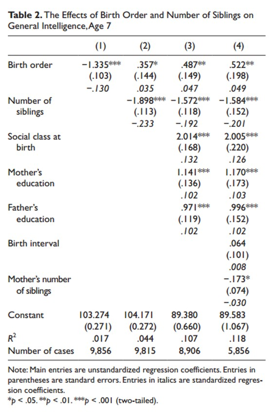

```{r, echo = FALSE, results = "hide"}
include_supplement("uu-multiple-linear-regression-821-en-tabel.jpg", recursive = TRUE)
```

Question
========
The table below is taken from Kanazawa’s article Intelligence, Birth Order, and Family Size (2012). 



In model 2, intelligence (General intelligence) is predicted on the basis of birth order (Birth order) and number of siblings (Number of siblings).

Answerlist
----------
* Number of siblings strengthens the effect of Birth order.
* Number of siblings is a stronger predictor of intelligence than Birth order.
* The predicted intelligence of a firstborn child from a family with 5 children is higher than the predicted intelligence of the last born child from a family with 3 children.
* More than one of the three answer alternatives (a, b, c) is correct.


Solution
========
Number of siblings is a stronger predictor of intelligence than Birth order. To decide which predictor is the stronger predictor, we need to look at the (absolute) value of the standardized regression coefficient. In model 2, the absolute value of the standardized regression coefficient of number of siblings (\beta = -.233) is bigger than that of birth order (\beta = .035). 

The statement Number of siblings strengthens the effect of Birth order is incorrect. This would be the case if the unstandardized regression coefficient of Birth order would have increased in model 2 compared to model 1, or if the p-value of the effect of Birth order would have decreased in model 2 compared to model 1. Neither is the case, so Number of siblings does not strengthen the effect of Birth order. 
The statement The predicted intelligence of a firstborn child from a family with 5 children is higher than the predicted intelligence of the last born child from a family with 3 children is incorrect. 
The regression equation is:
Predicted intelligence = 104.171 + 0.357* Birth order – 1.898*Number of siblings
The predicted intelligence of a firstborn child from a family with 5 children is lower than the predicted intelligence of the last born child from a family with 3 children.


Meta-information
================
exname: uu-multiple-linear-regression-821-en.Rmd
extype: schoice
exsolution: 0100
exsection: Inferential Statistics
exextra[Type]: Interpretating output
exextra[Program]: SPSS
exextra[Language]: English
exextra[Level]: Statistical Literacy