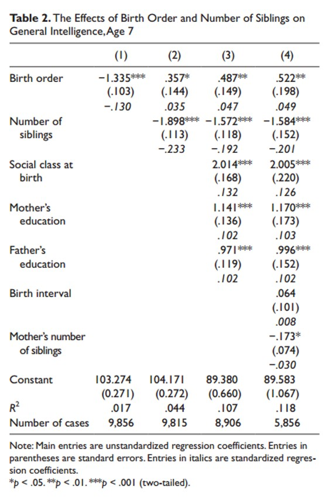

```{r, echo = FALSE, results = "hide"}
include_supplement("uu-multiple-linear-regression-821-en-tabel.jpg", recursive = TRUE)
```

Question
========
De tabel hieronder komt uit Kanazawa's artikel Intelligence, Birth Order, and Family Size (2012). 



In model 2 wordt intelligentie (Algemene intelligentie) voorspeld op basis van geboortevolgorde (Geboortevolgorde) en aantal broers en zussen (Aantal broers en zussen).

Antwoordlijst
----------
* Aantal broers en zussen versterkt het effect van Geboortevolgorde.
* Aantal broers en zussen is een sterkere voorspeller van intelligentie dan Geboortevolgorde.
* De voorspelde intelligentie van een eerstgeboren kind uit een gezin met 5 kinderen is hoger dan de voorspelde intelligentie van het laatstgeboren kind uit een gezin met 3 kinderen.
* Meer dan één van de drie antwoordmogelijkheden (a, b, c) is juist.


Solution
========
Aantal broers en zussen is een sterkere voorspeller van intelligentie dan Geboortevolgorde. Om te bepalen welke voorspeller sterker is, moeten we kijken naar de (absolute) waarde van de gestandaardiseerde regressiecoëfficiënt. In model 2 is de absolute waarde van de gestandaardiseerde regressiecoëfficiënt van het aantal broers en zussen (\beta = -.233) groter dan die van de geboortevolgorde (\beta = .035).

De Stelling Aantal broers en zussen versterkt het effect van Geboortevolgorde is onjuist. Dit zou het geval zijn als de niet-gestandaardiseerde regressiecoëfficiënt van Geboortevolgorde in model 2 zou zijn toegenomen ten opzichte van model 1, of als de p-waarde van het effect van Geboortevolgorde in model 2 zou zijn afgenomen ten opzichte van model 1. Geen van beide is het geval. Geen van beide is het geval, dus het aantal broers en zussen versterkt het effect van Geboortevolgorde niet. De Stelling De voorspelde intelligentie van een eerstgeboren kind uit een gezin met 5 kinderen is hoger dan de voorspelde intelligentie van het laatstgeboren kind uit een gezin met 3 kinderen is onjuist. De regressievergelijking is: Voorspelde intelligentie = 104,171 + 0,357*Geboortevolgorde - 1,898*Aantal broers en zussen De voorspelde intelligentie van een eerstgeboren kind uit een gezin met 5 kinderen is lager dan de voorspelde intelligentie van het laatstgeboren kind uit een gezin met 3 kinderen.

Meta-information
================
exname: uu-multiple-linear-regression-821-nl
extype: schoice
exsolution: 0100
exsection: Inferential Statistics
exextra[Type]: Interpretating output
exextra[Program]: SPSS
exextra[Language]: Dutch
exextra[Level]: Statistical Literacy