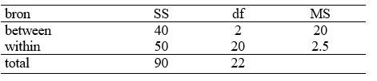

```{r, echo = FALSE, results = "hide"}
include_supplement("uu-oneway-anova-840-nl-tabel.jpg", recursive = TRUE)
```


Question
========
Uit een onderzoek is het resultaat in onderstaande ANOVA-tabel gepresenteerd


  
Hieruit blijkt dat:

Answerlist
----------
* Het gevonden resultaat is niet significant bij $\alpha = .05$ want $F_{obt} < F_{crit}$.
* Het gevonden resultaat is niet significant bij $\alpha = .05$ want $F_{obt} > F_{crit}$.
* Het gevonden resultaat is significant bij $\alpha = .05$ want $F_{obt} < F_{crit}$.
* Het gevonden resultaat is significant bij $\alpha = .05$ want $F_{obt} > F_{crit}$.


Solution
========

$F_{obt} =\frac{20}{2.5} = 8.0$. 
$F_{crit} = 3.49$ 


Meta-information
================
exname: uu-oneway-anova-840-nl
extype: schoice
exsolution: 0001
exsection: Inferential Statistics/Parametric Techniques/ANOVA/Oneway ANOVA
exextra[Type]: Interpretating output
exextra[Language]: Dutch
exextra[Level]: Statistical Literacy