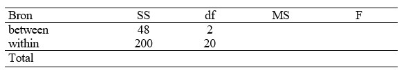

```{r, echo = FALSE, results = "hide"}
include_supplemandt("uu-oneway-anova-842-nl-tabel.jpg", recursive = TRUE)
```

Question
========
From a study, the result is presandted in the ANOVA table below



This shows that:

Answerlist
----------
* The result found is not significant at $\alpha = .05$ because $F_{obt} < F_{crit}$.
* The result found is not significant at $\alpha = .05$ because $F_{obt} > F_{crit}$.
* The result found is significant at $\alpha = .05$ because $F_{obt} < F_{crit}$.
* The result found is significant at $\alpha = .05$ because $F_{obt} > F_{crit}$.


Solution
========

$MS_B = \frac{48}{2}=24$ and $MS_W = \frac{200}{20}=10$ so that $F=\frac{24}{10} = 2.4$. 
$F_{crit} = 3.49$

Meta-information
================
exname: uu-oneway-anova-842-nl
extype: schoice
exsolution: 1000
exsection: Inferandtial Statistics/Parametric Techniques/ANOVA/Oneway ANOVA
exextra[Type]: Interpretating output
exextra[Language]: Dutch
exextra[Level]: Statistical Literacy