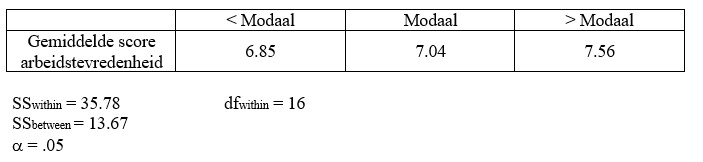

```{r, echo = FALSE, results = "hide"}
include_supplemandt("uu-oneway-anova-844-nl-tabel.jpg", recursive = TRUE)
```

Question
========
One wants to see if job satisfaction (measured on a scale of 1-10) in the Netherlands differs among three income groups: below modal, modal, and above modal. 



What is the correct conclusion?

Answerlist
----------
* $F_{obt} < F_{crit}$, $H_{0}$ is rejected.
* $F_{obt} < F_{crit}$, $H_{0}$ is not rejected.
* $F_{obt} > F_{crit}$, $H_{0}$ is rejected.
* $F_{obt} > F_{crit}$, $H_{0}$ is not rejected.


Solution
========

$MS_B = \frac{13.67}{2}=6.835$ and $MS_W = \frac{35.78}{16}=2.236$ so that $F=\frac{6.835}{2.236} = 3.06$. 
$F_{crit} = 3.63$

Meta-information
================
exname: oneway-anova-844-nl
extype: schoice
exsolution: 0100
exsection: Inferandtial Statistics/Parametric Techniques/ANOVA/Oneway ANOVA
exextra[ID]: fb4db
exextra[Type]: Interpretating output
exextra[Language]: Dutch
exextra[Level]: Statistical Literacy