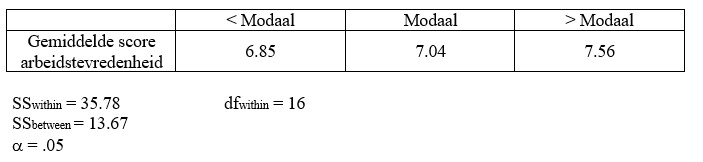

```{r, echo = FALSE, results = "hide"}
include_supplement("uu-oneway-anova-844-nl-tabel.jpg", recursive = TRUE)
```


Question
========
Men wil kijken of de arbeidstevredenheid (gemeten op een schaal van 1-10) in Nederland verschilt tussen drie inkomensgroepen: onder modaal, modaal, en boven modaal. 



Wat is de correcte conclusie?

Answerlist
----------
* $F_{obt} < F_{crit}$, $H_{0}$ wordt verworpen.
* $F_{obt} < F_{crit}$, $H_{0}$ wordt niet verworpen.
* $F_{obt} > F_{crit}$, $H_{0}$ wordt verworpen.
* $F_{obt} > F_{crit}$, $H_{0}$ wordt niet verworpen.


Solution
========

$MS_B = \frac{13.67}{2}=6.835$ en $MS_W = \frac{35.78}{16}=2.236$ zodat $F=\frac{6.835}{2.236} = 3.06$. 
$F_{crit} = 3.63$ 


Meta-information
================
exname: oneway-anova-844-nl
extype: schoice
exsolution: 0100
exsection: Inferential Statistics/Parametric Techniques/ANOVA/Oneway ANOVA
exextra[Type]: Interpretating output
exextra[Language]: Dutch
exextra[Level]: Statistical Literacy