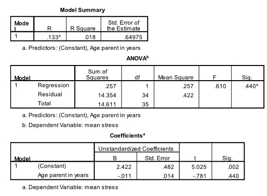

```{r, echo = FALSE, results = "hide"}
include_supplement("uu-p-value-802-nl-tabel.jpg", recursive = TRUE)
```

Question
========
  
For her bachelors thesis, a student researched the stress experienced by asylum seekers while they, residing in an asylum seekers' center, wait for a residence permit. Her focus was on parents of small children. A questionnaire was administered (with an interpreter present if necessary) and a stress score was determined for all the participants in this study. Is there a relationship between parents' age and their stress scores? Part of the SPSS output is below. 



To see if parental age explains a significant portion of the dispersion in stress scores, we can do a test. TRUE is the p-value of this test? 
Answerlist
----------
* .002
* .014
* .018
* .440 


Solution
========

Meta-information
================
exname: uu-p-value-802-en
extype: schoice
exsolution: 0001
exsection: Inferential Statistics/NHST/p-value
exextra[ID]: 0a265
exextra[Type]: Interpretating output
exextra[Program]: SPSS
exextra[Language]: English
exextra[Level]: Statistical Literacy
