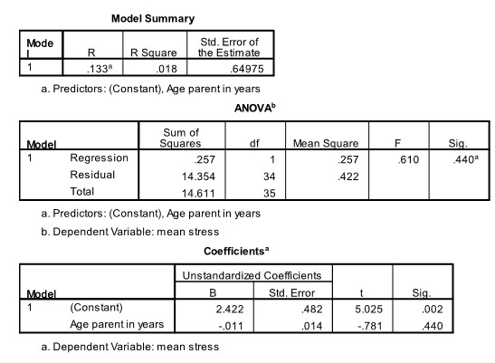

```{r, echo = FALSE, results = "hide"}
include_supplement("uu-p-value-802-nl-tabel.jpg", recursive = TRUE)
```


Question
========
  
Voor haar bachelors thesis heeft een studente onderzoek gedaan naar de stress die asielzoekers ondervinden terwijl ze, verblijvend in een asielzoekerscentrum, wachten op een verblijfsvergunning. Haar focus lag bij ouders van kleine kinderen. Een vragenlijst werd afgenomen (indien nodig met een tolk erbij) en een stress-score werd bepaald voor al de deelnemers aan dit onderzoek. Is er een verband tussen de leeftijd van de ouders en hun stress-scores? Een deel van de SPSS-output staat hieronder. 



Om te kijken of de leeftijd van de ouders een significant deel van de spreiding in stress-scores verklaart, kunnen we een test doen. Wat is de p-waarde van deze toets?
  
Answerlist
----------
* .002
* .014
* .018
* .440 


Solution
========
  


Meta-information
================
exname: uu-p-value-802-nl.Rmd
extype: schoice
exsolution: 0001
exsection: Inferential Statistics/NHST/p-value
exextra[ID]: f12a5
exextra[Type]: Interpretating output
exextra[Program]: SPSS
exextra[Language]: Dutch
exextra[Level]: Statistical Literacy
