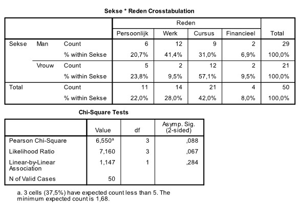

```{r, echo = FALSE, results = "hide"}
include_supplement("uu-p-value-803-nl-tabel.jpg", recursive = TRUE)
```

Question
========
Why do students quit a course? A researcher at the Faculty of Social Sciences surveyed 52 students at Utrecht University who quit a course in the past year. They could choose from four different reasons: Personal, Course-related, Work, or Financial. Does the reason for quitting depend on the student's gender?

SPSS output is below.




What is the outcome of this test at $\alpha = .05$?  Men's and women's reasons for quitting a course . . .

  
Answerlist
----------
* Differed significantly, as the p-value is .044.
* Did not differ significantly, as the p-value is .067.
* Did not differ significantly, as the p-value is .088.
* Did not differ significantly, as the p-value is .284. 


Solution
========

Meta-information
================
exname: uu-p-value-803-en
extype: schoice
exsolution: 0010
exsection: Inferential Statistics/NHST/p-value
exextra[Type]: Interpretating output
exextra[Program]: SPSS
exextra[Language]: English
exextra[Level]: Statistical Literacy
