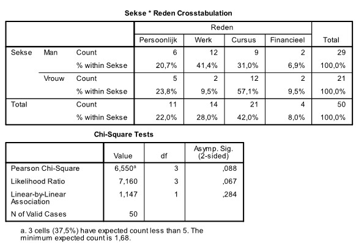

```{r, echo = FALSE, results = "hide"}
include_supplement("uu-p-value-803-nl-tabel.jpg", recursive = TRUE)
```


Question
========
Waarom stoppen studenten met een cursus? Een onderzoeker aan de Faculteit Sociale Wetenschappen ondervraagt 52 studenten van de Universiteit Utrecht die in het afgelopen jaar gestopt zijn met een cursus. Er kon gekozen worden uit vier verschillende redenen: Persoonlijk, Cursusgerelateerd, Werk, of Financieel. Hangt de reden om te stoppen af van het geslacht van de student? 

SPSS-output staat hieronder.




Wat is de uitkomst van deze toets bij $\alpha = .05$? 
 
De redenen van mannen en vrouwen om met een cursus te stoppen . . . 

  
Answerlist
----------
* verschilden significant, want de p-waarde is .044. 
* verschilden niet significant, want de p-waarde is .067. 
* verschilden niet significant, want de p-waarde is .088. 
* verschilden niet significant, want de p-waarde is .284. 


Solution
========
  


Meta-information
================
exname: uu-p-value-803-nl.Rmd
extype: schoice
exsolution: 0010
exsection: Inferential Statistics/NHST/p-value
exextra[Type]: Interpretating output
exextra[Program]: SPSS
exextra[Language]: Dutch
exextra[Level]: Statistical Literacy
