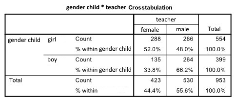

```{r, echo = FALSE, results = "hide"}
include_supplement("uu-p-value-804-nl-tabel.jpg", recursive = TRUE)
```

Question
========
In a survey of children's preferences in education, 953 children in grades 5 through 8 were asked, "Would you rather have a teacher or a master in front of the class?" The responses, split by the child's sex, are in the SPSS output below.




The researchers want to test the null hypothesis that there is no difference between boys and girls in preference for a teacher.


To test the null hypothesis that there is no difference between boys and girls in preference for a teacher or master, a chi-square test is done. As the test size, the value $\chi^2$ = 30,957 found.

What do we know about the p-value of this test?


  
Answerlist
----------
* The p-value is greater than .10
* The p-value is somewhere between .05 and .10
* The p-value is somewhere between .025 and .05
* The p-value is less than .01

Solution
========

Meta-information
================
exname: uu-p-value-804-en
extype: schoice
exsolution: 0001
exsection: Inferential Statistics/NHST/p-value
exextra[ID]: 88a01
exextra[Type]: Interpretating output
exextra[Program]: SPSS
exextra[Language]: English
exextra[Level]: Statistical Literacy
