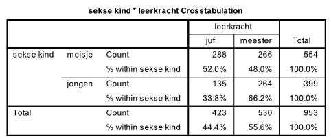

```{r, echo = FALSE, results = "hide"}
include_supplement("uu-p-value-804-nl-tabel.jpg", recursive = TRUE)
```


Question
========
In een onderzoek naar de voorkeur van kinderen in het onderwijs werd aan 953 kinderen in groepen 5 tot en met 8 gevraagd: “Heb je liever een juf of een meester voor de klas?” De antwoorden, gesplitst naar sekse van het kind, staan in de SPSS-output hieronder.




De onderzoekers willen de nulhypothese toetsen dat er geen verschil is tussen jongens en meisjes in voorkeur voor een juf of meester.


Om de nulhypothese te toetsen dat er geen verschil is tussen jongens en meisjes in voorkeur voor een juf of meester, wordt er een chi-kwadraat toets gedaan. Als toetsingsgrootheid wordt de waarde $\chi^2$ = 30.957 gevonden.

Wat weten we over de p-waarde van deze toets?


  
Answerlist
----------
* de p-waarde is groter dan .10
* de p-waarde ligt ergens tussen .05 en .10
* de p-waarde ligt ergens tussen .025 en .05
* de p-waarde is kleiner dan .01


Solution
========
  


Meta-information
================
exname: uu-p-value-804-nl.Rmd
extype: schoice
exsolution: 0001
exsection: Inferential Statistics/NHST/p-value
exextra[ID]: 0874b
exextra[Type]: Interpretating output
exextra[Program]: SPSS
exextra[Language]: Dutch
exextra[Level]: Statistical Literacy
