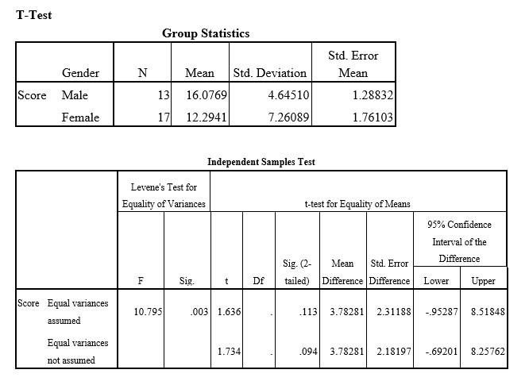

```{r, echo = FALSE, results = "hide"}
include_supplement("uu-p-value-810-en-tabel.jpg", recursive = TRUE)
```


Question
========
  
A researcher expects male students to perform better on a given test than female students. To investigate this, he invites 13 males and 17 females to do a mathematical test. All participants make exactly the same test and are given all the time they need to complete it. The researcher then scores the correct answers and executes a t-test in SPSS. The output of the SPSS analysis of this test is below.


  
Answerlist
----------
* p=.113
* p=.094
* p=.047 
* p=.0565 


Solution
========
  


Meta-information
================
exname: uu-p-value-810-en.Rmd
extype: schoice
exsolution: 0010
exsection: Inferential Statistics/NHST/p-value
exextra[ID]: dd0e5
exextra[Type]: Interpretating output
exextra[Program]: SPSS
exextra[Language]: English
exextra[Level]: Statistical Literacy
