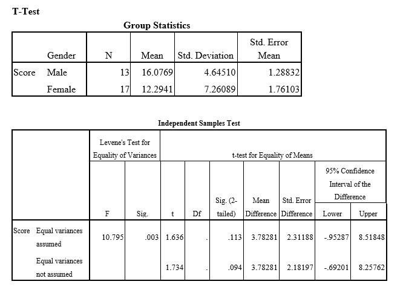

```{r, echo = FALSE, results = "hide"}
include_supplement("uu-p-value-810-en-tabel.jpg", recursive = TRUE)
```

Question
========
  
Een onderzoeker verwacht dat mannelijke studenten beter presteren op een bepaalde test dan vrouwelijke studenten. Om dit te onderzoeken nodigt hij 13 mannen en 17 vrouwen uit om een wiskundige test te maken. Alle deelnemers maken exact dezelfde test en krijgen alle tijd die ze nodig hebben. De onderzoeker scoort vervolgens de juiste antwoorden en voert een t-test uit in SPSS. De uitvoer van de SPSS-analyse van deze test staat hieronder.


  
Antwoordlijst
----------
* P=.113
* P=.094
* P=.047
* P=.0565 


Solution
========

Meta-information
================
exname: uu-p-value-810-nl
extype: schoice
exsolution: 0010
exsection: Inferential Statistics/NHST/p-value
exextra[Type]: Interpretating output
exextra[Program]: SPSS
exextra[Language]: Dutch
exextra[Level]: Statistical Literacy
