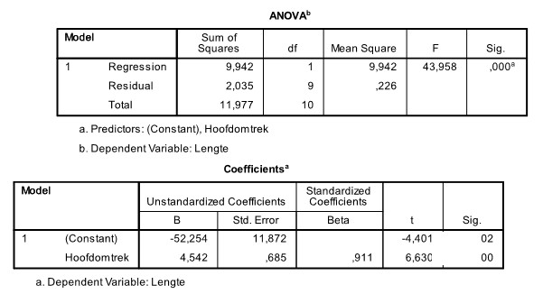

```{r, echo = FALSE, results = "hide"}
include_supplement("uu-t-statistic-800-nl-tabel.jpg", recursive = TRUE)
```

Question
========
  
A pediatrician would like to describe the relationship that may exist between children's height and head circumference. She is collecting data from some 3-year-old patients from her practice. Part of the SPSS output is below.



To see if the relationship between head circumference and height of 3-year-olds is significant, we can do a t test. What is the value of the test magnitude of this test? 
Answerlist
----------
* T = -4.40
* T = 43.96
* T = 0.685
* T = 6.63 


Solution
========

Meta-information
================
exname: uu-t-statistic-800-en
extype: schoice
exsolution: 0001
exsection: Inferential Statistics/NHST/Test statistic/t-statistic
exextra[ID]: 46ce9
exextra[Type]: Interpretating output
exextra[Program]: SPSS
exextra[Language]: English
exextra[Level]: Statistical Literacy
