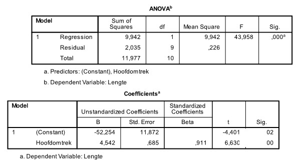

```{r, echo = FALSE, results = "hide"}
include_supplement("uu-t-statistic-800-nl-tabel.jpg", recursive = TRUE)
```


Question
========
  
Een kinderarts wil graag de relatie beschrijven die eventueel bestaat tussen de lengte van kinderen en hun hoofdomtrek. Ze verzamelt data van enkele 3-jarige patiënten van haar praktijk. Een deel van de SPSS-output staat hieronder.



Om te kijken of de relatie tussen hoofdomtrek en lengte van 3-jarigen significant is, kunnen we een t-toets doen. Wat is de waarde van de toetsingsgrootheid van deze toets?
  
Answerlist
----------
* t = −4.40
* t = 43.96
* t = 0.685 
* t = 6.63 


Solution
========
  


Answerlist
----------


Meta-information
================
exname: uu-t-statistic-800-nl.Rmd
extype: schoice
exsolution: 0001
exsection: Inferential Statistics/NHST/Test statistic/t-statistic
exextra[Type]: Interpretating output
exextra[Program]: SPSS
exextra[Language]: Dutch
exextra[Level]: Statistical Literacy
