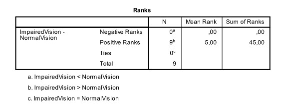

```{r, echo = FALSE, results = "hide"}
include_supplement("uu-t-statistic-808-nl-tabel.jpg", recursive = TRUE)
```

Question
========
  
To show what happens when you get behind the wheel with a drink, a police officer brings a simulator to a 6th grade VWO class. In a group of 9 students, reaction time is first measured under normal conditions (NormalVision) and then again with the special virtual simulator glasses on, which mimics the effect of alcohol on vision (ImpairedVision). SPSS was used to use a Wilcoxon rank test for paired groups to determine whether reaction time was faster under normal conditions than with the simulator glasses on. Some of the output is shown below. 



What is the outcome of this test at $\alpha = .05$? 
Answerlist
----------
* The difference is significant because T = 5 and that is greater than the critical value of 3.
* The difference is significant, because T = 0 and that is smaller than the critical value of 3.
* The difference is not significant because T = 0 and that is not greater than the critical value of 0.
* The difference is not significant because T = 5 and that is greater than the critical value of 1. 


Solution
========

Meta-information
================
exname: uu-t-statistic-808-en
extype: schoice
exsolution: 0100
exsection: Inferential Statistics/NHST/Test statistic/t-statistic
exextra[ID]: 3f235
exextra[Type]: Interpretating output
exextra[Program]: SPSS
exextra[Language]: English
exextra[Level]: Statistical Literacy
