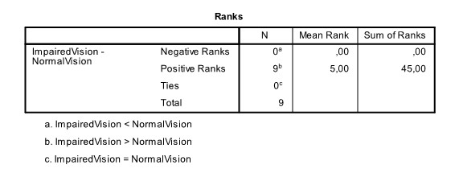

```{r, echo = FALSE, results = "hide"}
include_supplement("uu-t-statistic-808-nl-tabel.jpg", recursive = TRUE)
```


Question
========
  
Om te laten zien wat er gebeurt als je met een slok op achter het stuur kruipt, brengt een politieagent een simulator mee naar een 6de klas van het VWO. Bij een groepje van 9 leerlingen wordt eerst de reactietijd gemeten onder normale omstandigheden (NormalVision) en daarna ook nog een keer met de speciale virtuele simulatorbril op, die het effect van alcohol op het gezichtsvermogen nabootst (ImpairedVision). SPSS is gebruikt om met een Wilcoxon-rangtekentoets voor gekoppelde groepen te bepalen of de reactietijd onder normale omstandigheden sneller is dan met de simulatorbril op. Een deel van de output staat hieronder. 



Wat is de uitkomst van deze toets bij $\alpha = .05$?
  
Answerlist
----------
* Het verschil is significant, want T = 5 en dat is groter dan de kritieke waarde van 3. 
* Het verschil is significant, want T = 0 en dat is kleiner dan de kritieke waarde van 3. 
* Het verschil is niet significant, want T = 0 en dat is niet groter dan de kritieke waarde van 0. 
* Het verschil is niet significant, want T = 5 en dat is groter dan de kritieke waarde van 1. 


Solution
========
  


Meta-information
================
exname: uu-t-statistic-808-nl.Rmd
extype: schoice
exsolution: 0100
exsection: Inferential Statistics/NHST/Test statistic/t-statistic
exextra[ID]: c8c15
exextra[Type]: Interpretating output
exextra[Program]: SPSS
exextra[Language]: Dutch
exextra[Level]: Statistical Literacy
