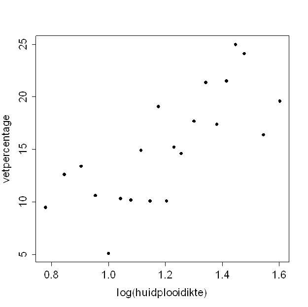

```{r, echo = FALSE, results = "hide"}
include_supplement("uva-equation-1385-nl-graph01.png", recursive = TRUE)
```

Question
========

Vetpercentage kan geschat worden met behulp van (de logaritme van) de
som van de huidplooidiktes van biceps en triceps.\
Bijgaand is een spreidingsdiagram waarin deze beide variabelen tegen
elkaar staan uitgezet.\
De vergelijking van de bijbehorende regressielijn luidt:



Answerlist
----------

vetpercentage = 5 + 24 x log(huidplooidikte)
vetpercentage = 9 + 19 x log(huidplooidikte)
vetpercentage = -13 + 25 x log(huidplooidikte)
vetpercentage = -6 + 17 x log(huidplooidikte)

Solution
========

Answerlist
----------

vetpercentage = 5 + 24 x log(huidplooidikte): Incorrect
vetpercentage = 9 + 19 x log(huidplooidikte): Incorrect
vetpercentage = -13 + 25 x log(huidplooidikte): Incorrect
vetpercentage = -6 + 17 x log(huidplooidikte): Correct

Meta-information
================
exname: uva-equation-1385-nl
extype: schoice
exsolution: 0001
exsection: Inferential Statistics/Regression/Equation
exextra[Type]: Conceptual
exextra[Language]: Dutch
exextra[Level]: Statistical Literacy
exextra[IRT-Difficulty]: 0
exextra[p-value]: 0.9242
