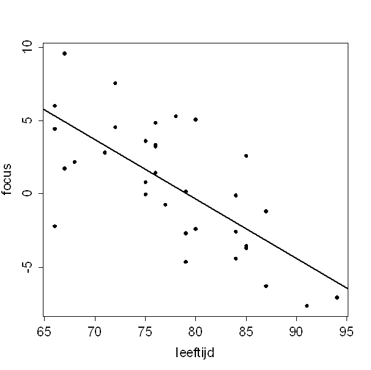

```{r, echo = FALSE, results = "hide"}
include_supplement("uva-equation-1392-nl-graph01.png", recursive = TRUE)
```

Question
========

In een onderzoek is bij 33 ouderen gekeken naar het verband tussen
leeftijd en het vermogen om ergens op te focussen. Hieronder staat een
spreidingsdiagram van de resultaten, met de bijbehorende regressielijn.\
Per toename in leeftijd van 10 jaar neemt het vermogen om te focussen af
met ongeveer:



Answerlist
----------

0.4
1
2.5
4

Solution
========

Answerlist
----------

0.4: Incorrect
1: Incorrect
2.5: Incorrect
4: Correct

Meta-information
================
exname: uva-equation-1392-nl
extype: schoice
exsolution: 0001
exsection: Inferential Statistics/Regression/Equation
exextra[Type]: Calculation
exextra[Language]: Dutch
exextra[Level]: Statistical Literacy
exextra[IRT-Difficulty]: 0
exextra[p-value]: 0.9242
