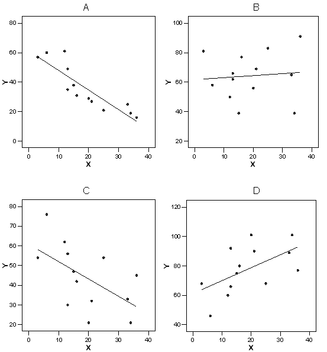

```{r, echo = FALSE, results = "hide"}
include_supplement("uva-equation-287-nl-graph01.png", recursive = TRUE)
```

Question
========

Hieronder staan 4 spreidingsdiagrammen (genaamd A, B, C en D) van X en
Y. In welk van de 4 spreidingsdiagrammen is de variatie in Y die door X
kan worden verklaard het hoogst?



Answerlist
----------

* A
* B
* C
* D

Solution
========

Answerlist
----------

* A: Correct
* B: Incorrect
* C: Incorrect
* D: Incorrect

Meta-information
================
exname: uva-equation-287-nl
extype: schoice
exsolution: 1000
exsection: Inferential Statistics/Regression/Equation
exextra[ID]: 6a2ff
exextra[Type]: Conceptual
exextra[Language]: Dutch
exextra[Level]: Statistical Literacy
exextra[IRT-Difficulty]: 1.018
exextra[p-value]: 0.8907
