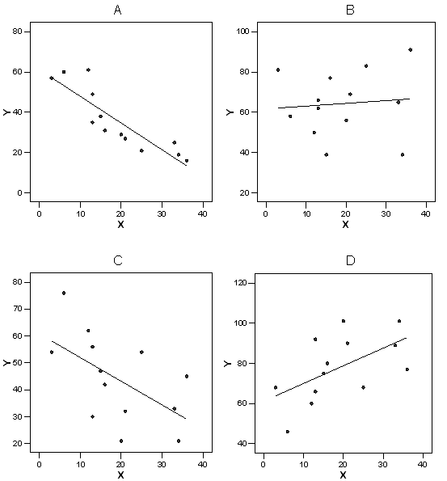

```{r, echo = FALSE, results = "hide"}
include_supplement("uva-equation-288-nl-graph01.png", recursive = TRUE)
```

Question
========

Below are 4 scatterplots (called A, B, C and D) of X and Y. In which of the 4 scatterplots is the equation of the regression equation equal to Y = 61 + 0.88 X?



Answerlist
----------

* A
* B
* C
* D

Solution
========

Answerlist
----------

* A: Incorrect
* B: Incorrect
* C: Incorrect
* D: Correct

Meta-information
================
exname: uva-equation-288-en
extype: schoice
exsolution: 0001
exsection: Inferential Statistics/Regression/Equation
exextra[ID]: bc4e7
exextra[Type]: Conceptual
exextra[Language]: English
exextra[Level]: Statistical Literacy
exextra[IRT-Difficulty]: 2.604
exextra[p-value]: 0.4507
