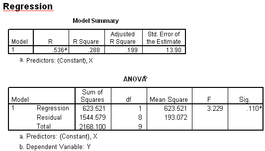

```{r, echo = FALSE, results = "hide"}
include_supplement("uva-equation-409-nl-graph01.png", recursive = TRUE)
```

Question
========

Hieronder staat SPSS-uitvoer van een regressieanalyse van Y op X. De
vergelijking van de regressielijn van Y op X luidt



Answerlist
----------

* Y = 62.047 - 0.496 X
* Y = -0.496 - 0.536 X
* Y = -0.496 + 0.276 X
* Y = -0.496 + 62.047 X

Solution
========

Answerlist
----------

* Y = 62.047 - 0.496 X: Correct
* Y = -0.496 - 0.536 X: Incorrect
* Y = -0.496 + 0.276 X: Incorrect
* Y = -0.496 + 62.047 X: Incorrect

Meta-information
================
exname: uva-equation-409-nl
extype: schoice
exsolution: 1000
exsection: Inferential Statistics/Regression/Equation
exextra[ID]: 92b68
exextra[Type]: Interpreting output
exextra[Language]: Dutch
exextra[Level]: Statistical Literacy
exextra[IRT-Difficulty]: 5.276
exextra[p-value]: 0.0062
