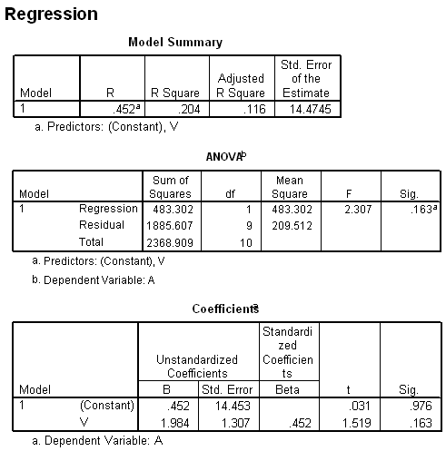

```{r, echo = FALSE, results = "hide"}
include_supplement("uva-equation-507-nl-graph01.png", recursive = TRUE)
```

Question
========

De vergelijking van de regressievergelijking luidt



Answerlist
----------

A = 0.452 + 1.984 x V
A = 1.984 + 0.452 x V
V = 0.452 + 1.984 x A
V = 1.984 + 0.452 x V

Solution
========

Answerlist
----------

A = 0.452 + 1.984 x V: Correct
A = 1.984 + 0.452 x V: Incorrect
V = 0.452 + 1.984 x A: Incorrect
V = 1.984 + 0.452 x V: Incorrect

Meta-information
================
exname: uva-equation-507-nl
extype: schoice
exsolution: 1000
exsection: Inferential Statistics/Regression/Equation
exextra[Type]: Conceptual
exextra[Language]: Dutch
exextra[Level]: Statistical Literacy
exextra[IRT-Difficulty]: 4.606
exextra[p-value]: 0.0144
