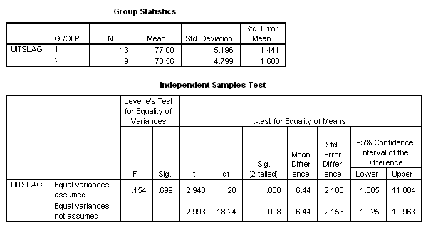

```{r, echo = FALSE, results = "hide"}
include_supplement("uva-independent-samples-means-279-nl-graph01.png", recursive = TRUE)
```

Question
========

When testing H~0~: μ~1~ = μ~2~ against H~1~: μ~1~ ≠ μ~2~ with 5% significance level, the conclusion should be:



Answerlist
----------

* The test result is significant, reject H0.
* The test result is significant, do not reject H0.
* The test result is not significant, reject H0.
* The test result is not significant, do not reject H0.

Solution
========

Answerlist
----------

* The test result is significant, reject H0...: Correct
* The test result is significant, reject H0: Incorrect
* The test result is not significant, reject H0...: Incorrect
* The test result is not significant, reject H0: Incorrect

Meta-information
================
exname: uva-independent-samples-means-279-en
extype: schoice
exsolution: 1000
exsection: Inferential Statistics/Parametric Techniques/t-test/Independent samples means
exextra[Type]: Conceptual
exextra[Language]: English
exextra[Level]: Statistical Literacy
exextra[IRT-Difficulty]: 3.637
exextra[p-value]: 0.18
