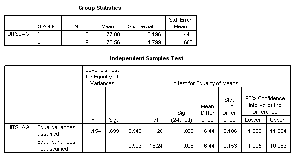

```{r, echo = FALSE, results = "hide"}
include_supplement("uva-independent-samples-means-280-nl-graph01.png", recursive = TRUE)
```

Question
========

The value from the T-distribution table used in the calculating the *equal variances assumed* 95% confidence interval, (1.885 ; 11.004), is equal to



Answerlist
----------

* 1.7247
* 2.086
* 2.186
* 2.948

Solution
========

Answerlist
----------

* 1.7247: Incorrect
* 2.086: Correct
* 2,186: Incorrect
* 2.948: Incorrect

Meta-information
================
exname: uva-independent-samples-means-280-en
extype: schoice
exsolution: 0100
exsection: Inferential Statistics/Parametric Techniques/t-test/Independent samples means
exextra[Type]: Conceptual, Calculation
exextra[Language]: English
exextra[Level]: Statistical Literacy
exextra[IRT-Difficulty]: 3.345
exextra[p-value]: 0.2336
