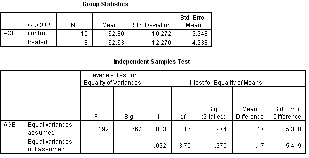

```{r, echo = FALSE, results = "hide"}
include_supplement("uva-independent-samples-means-311-nl-graph01.png", recursive = TRUE)
```

Question
========

For an experiment on the effectiveness of an assistance program for self-efficacy in the elderly, people are randomly assigned to a control or treated group. The SPSS output below includes a test on equality of mean age. The pooled variance estimator is equal to



Answerlist
----------

* 124.24
* 125.22
* 125.53
* 128.03

Solution
========

Answerlist
----------

* 124.24: Incorrect
* 125.22: Correct
* 125.53: Incorrect
* 128.03: Incorrect

Meta-information
================
exname: uva-independent-samples-means-311-en
extype: schoice
exsolution: 0100
exsection: Inferential Statistics/Parametric Techniques/t-test/Independent samples means
exextra[Type]: Interpreting output, Calculation
exextra[Language]: English
exextra[Level]: Statistical Literacy
exextra[IRT-Difficulty]: 3.994
exextra[p-value]: 0.1233
