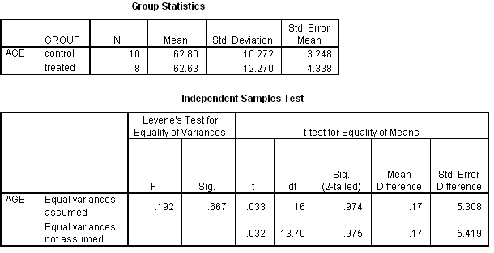

```{r, echo = FALSE, results = "hide"}
include_supplement("uva-independent-samples-means-311-nl-graph01.png", recursive = TRUE)
```

Question
========

Voor een experiment over de effectiviteit van een hulpprogramma voor
zelfredzaamheid bij ouderen worden mensen aselect in een controle- of
behandelde groep ingedeeld. In onderstaande SPSS uitvoer staat een toets
op gelijkheid van gemiddelde leeftijd. De gepoolde variantieschatter is
gelijk aan



Answerlist
----------

124.24
125.22
125.53
128.03

Solution
========

Answerlist
----------

124.24: Incorrect
125.22: Correct
125.53: Incorrect
128.03: Incorrect

Meta-information
================
exname: uva-independent-samples-means-311-nl
extype: schoice
exsolution: 0100
exsection: Inferential Statistics/Parametric Techniques/t-test/Independent samples means
exextra[Type]: Interpreting output, Calculation
exextra[Language]: Dutch
exextra[Level]: Statistical Literacy
exextra[IRT-Difficulty]: 3.994
exextra[p-value]: 0.1233
