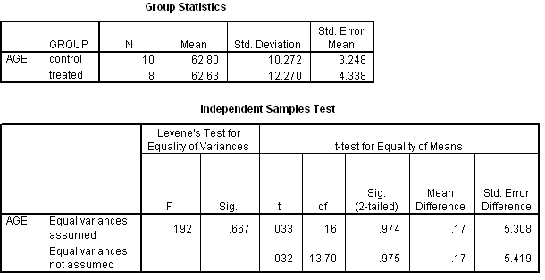

```{r, echo = FALSE, results = "hide"}
include_supplement("uva-independent-samples-means-312-nl-graph01.png", recursive = TRUE)
```

Question
========

For an experiment on the effectiveness of an assistance program for self-efficacy in the elderly, people are randomly assigned to a control or treated group. The SPSS output below includes a test on equality of mean age. At a two-sided risk of 5% the conclusion of this t-test for equality of means should read:



Answerlist
----------

* Population averages are unequal
* Population averages could be equal
* Sample averages are unequal
* Sample averages could be equal

Solution
========

Answerlist
----------

* Population averages are unequal: Incorrect
* Population averages could be equal: Correct
* Sample averages are unequal: Incorrect
* Sample averages could be equal: Incorrect

Meta-information
================
exname: uva-independent-samples-means-312-en
extype: schoice
exsolution: 0100
exsection: Inferential Statistics/Parametric Techniques/t-test/Independent samples means
exextra[ID]: ca3ae
exextra[Type]: Conceptual, Interpreting output
exextra[Language]: English
exextra[Level]: Statistical Literacy
exextra[IRT-Difficulty]: 3.836
exextra[p-value]: 0.1496
