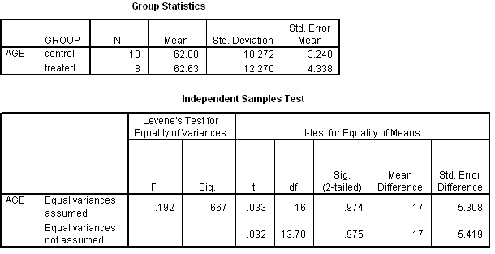

```{r, echo = FALSE, results = "hide"}
include_supplement("uva-independent-samples-means-312-nl-graph01.png", recursive = TRUE)
```

Question
========

Voor een experiment over de effectiviteit van een hulpprogramma voor
zelfredzaamheid bij ouderen worden mensen aselect in een controle- of
behandelde groep ingedeeld. In onderstaande SPSS uitvoer staat een toets
op gelijkheid van gemiddelde leeftijd. Bij een tweezijdig risico van 5%
zou de conclusie van deze t-toets voor gelijkheid van gemiddelden moeten
luiden:



Answerlist
----------

* Populatiegemiddelden zijn ongelijk
* Populatiegemiddelden zouden gelijk kunnen zijn
* Steekproefgemiddelden zijn ongelijk
* Steekproefgemiddelden zouden gelijk kunnen zijn

Solution
========

Answerlist
----------

* Populatiegemiddelden zijn ongelijk: Incorrect
* Populatiegemiddelden zouden gelijk kunnen zijn: Correct
* Steekproefgemiddelden zijn ongelijk: Incorrect
* Steekproefgemiddelden zouden gelijk kunnen zijn: Incorrect

Meta-information
================
exname: uva-independent-samples-means-312-nl
extype: schoice
exsolution: 0100
exsection: Inferential Statistics/Parametric Techniques/t-test/Independent samples means
exextra[Type]: Conceptual, Interpreting output
exextra[Language]: Dutch
exextra[Level]: Statistical Literacy
exextra[IRT-Difficulty]: 3.836
exextra[p-value]: 0.1496
