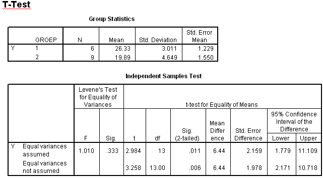

```{r, echo = FALSE, results = "hide"}
include_supplement("uva-independent-samples-means-320-nl-graph01.png", recursive = TRUE)
```

Question
========

If we were to run an F test for equality of variances with a two-sided risk of 10%, the right-hand critical value would be equal to



Answerlist
----------

* 3.37
* 3.69
* 4.1
* 4.82

Solution
========

Answerlist
----------

* 3.37: Incorrect
* 3.69: Incorrect
* 4.1: Incorrect
* 4.82: Correct

Meta-information
================
exname: uva-independent-samples-means-320-en
extype: schoice
exsolution: 0001
exsection: Inferential Statistics/Parametric Techniques/t-test/Independent samples means
exextra[Type]: Calculation
exextra[Language]: English
exextra[Level]: Statistical Literacy
exextra[IRT-Difficulty]: 3.951
exextra[p-value]: 0.1341
